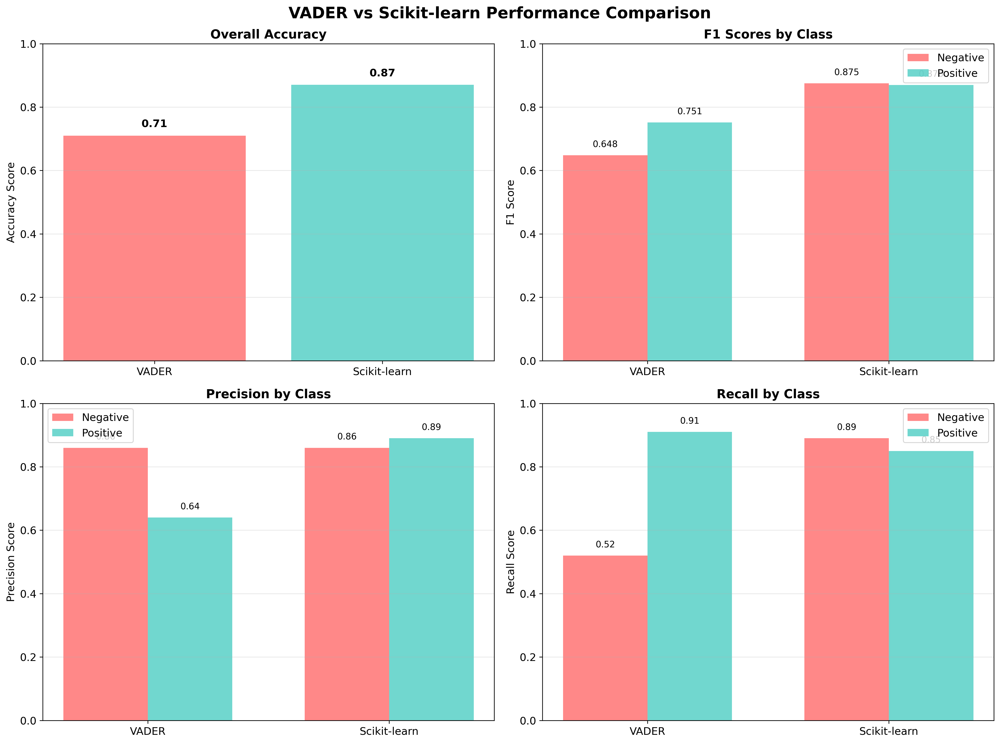

# Sentiment Analysis: VADER vs Scikit-learn

A comparison of lexicon-based and machine learning approaches for sentiment analysis using Amazon movie reviews.

## Overview

This project compares two different sentiment analysis methods:
- **VADER**: A lexicon-based approach using NLTK's VADER sentiment analyzer
- **Scikit-learn**: A machine learning approach using TF-IDF vectorization and LinearSVC

The analysis is performed on a dataset of 10,000 reviews with pre-labeled positive and negative sentiments.

## Dataset

- **Source**: Amazon product reviews
- **Size**: 10,000 reviews
- **Format**: TSV file with 'label' and 'review' columns
- **Labels**: 'pos' (positive) and 'neg' (negative)

## Methods

### VADER Sentiment Analysis
- Uses NLTK's VADER (Valence Aware Dictionary and sEntiment Reasoner) lexicon
- Rule-based approach with predefined sentiment scores
- No training required
- Fast and lightweight

### Scikit-learn Pipeline
- TF-IDF vectorization for text feature extraction
- Linear Support Vector Classification (LinearSVC)
- Train/test split (67%/33%)
- Requires labeled training data

## Results

### Performance Comparison



## Key Findings

- Scikit-learn achieved higher overall accuracy (87% vs 71%)
- VADER shows bias toward positive predictions
- Scikit-learn provides more balanced performance across classes
- VADER struggles with negative sentiment detection (52% recall)

## Files

- `sentiment_analysis.py`: Main analysis script
- `amazonreviews.tsv`: Dataset file
- `README.md`: This file

## Requirements

- Python 3.7+
- pandas
- numpy
- nltk
- scikit-learn
- matplotlib
- seaborn

## Usage

1. Ensure you have the required packages installed:
   ```bash
   pip install pandas numpy matplotlib nltk scikit-learn
   ```

2. Place the `amazonreviews.tsv` file in the same directory as the script

3. Run the analysis:
   ```bash
   python sentiment_analysis.py
   ```

4. The script will automatically:
   - Load and analyze the data
   - Perform VADER sentiment analysis
   - Train and evaluate Scikit-learn model
   - Generate all visualizations
   - Display results

## Notes

- The script automatically downloads required NLTK data
- Results may vary slightly due to random train/test splitting
- All visualizations are saved as high-quality PNG files
